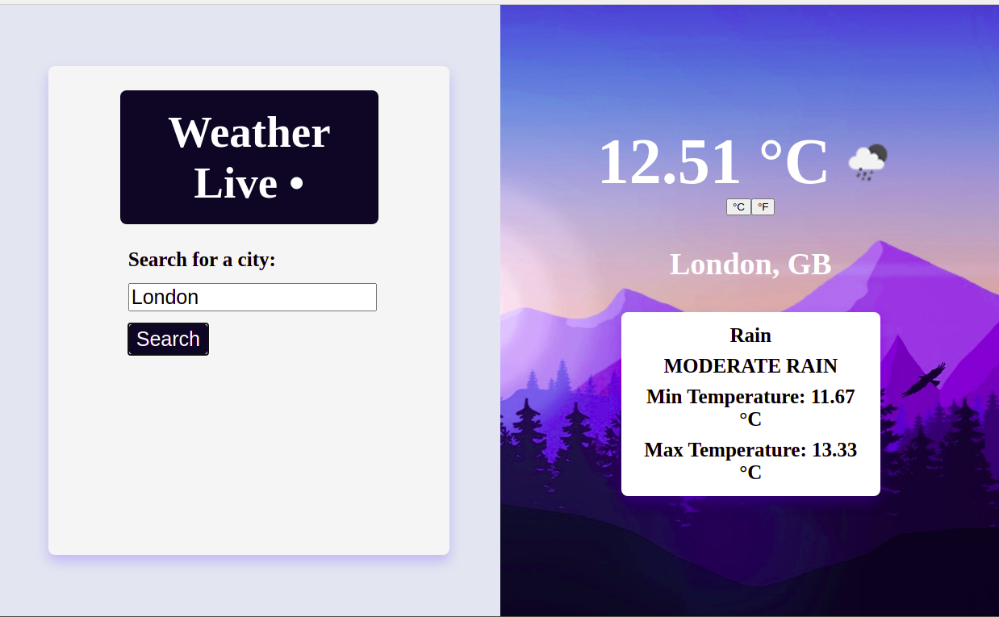

<h1 align="center">Weather APP</h1>

> A weather app to display current information from a specific place. Using JS connected with a third-part API and applying concepts about Promises, Async/Await syntax, and API connection.

### You can access a Live Demo [HERE](https://marilenaroque.github.io/weatherApp/)

## Features

- User can search for a city
- User can see the weather information about that local.
- User can choose between Celsius and Fahrenhiet for the Temperature Unit.

## Built With

- Javascript
- Webpack
- HTML5
- CSS3

## Getting Started

To get a local copy of this project running follow these simple steps.

- Clone this repository
 > `git clone <repo>`
- Navigate to the Repo Folder
- To set Webpack and the dependencies run the command
> `npm install`
- Use your favorite browser to open the index.html file (located at the dist page)

## Authors

👤 **Marilena Roque**

- Github: [MarilenaRoque](https://github.com/MarilenaRoque)
- Twitter: [@MariRoq88285995](https://twitter.com/MariRoq88285995)
- Linkedin: [roquemarilena](https://www.linkedin.com/in/roquemarilena/)

## 🤝 Contributing

Contributions, issues and feature requests are welcome!

Feel free to check the [issues page](issues/).

## Show your support

Give a ⭐️ if you like this project!